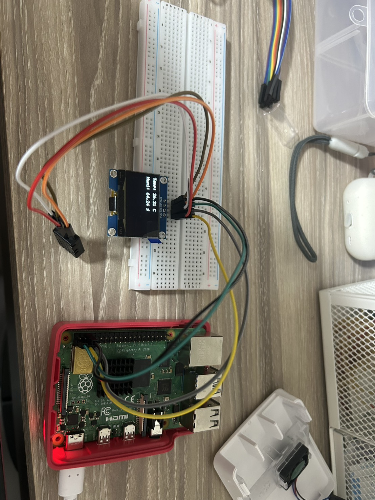

# Raspberry Pi Temperature & Humidity Display System (AHT20 + OLED)

This project uses a C program on Raspberry Pi to read temperature and humidity data from an AHT20 sensor via I2C, and display the results on an OLED screen.
It involves sensor communication, data parsing, and real-time visualization through low-level device control.


## My notes

(sensor)

https://hackmd.io/xTgy64DCQUGVAlp3CVSeKA 

(oled)

https://hackmd.io/fD7gAp37TKKviKNXXmiPHg

https://hackmd.io/oxxvyPPXQyGce2yy7AHCrQ

## Steps

```
gcc aht20_oled.c -o aht20_oled
```

```
./aht20_oled
```


## demo


